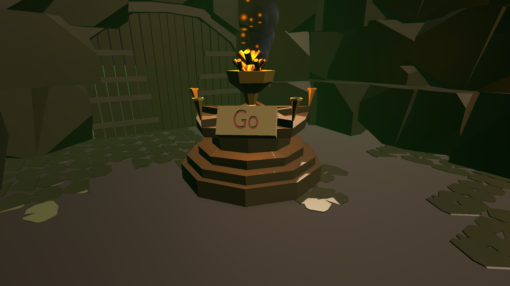
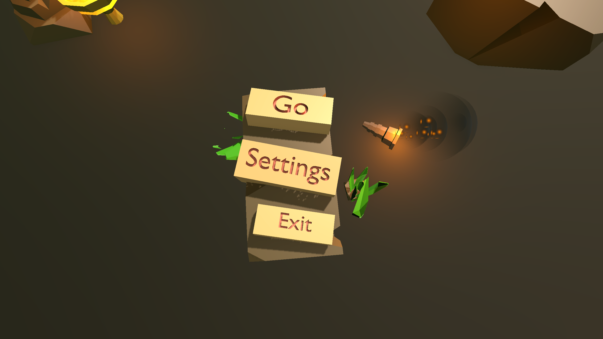
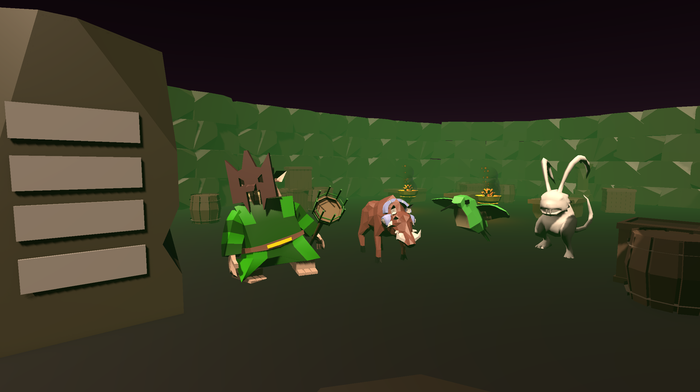
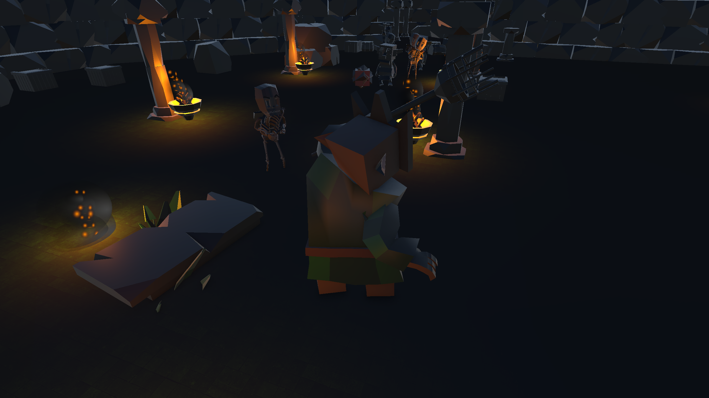
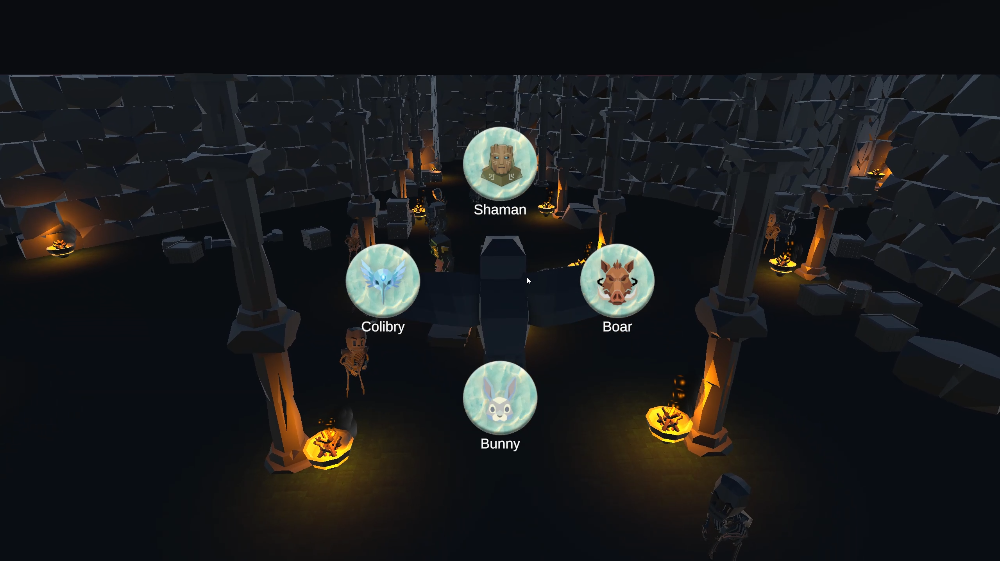
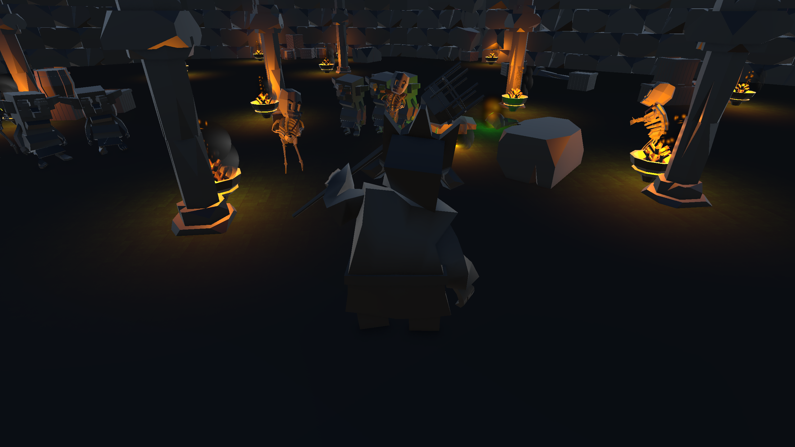

# 🗿 MaskBound Temple

**MaskBound Temple** — це 3D гра від третьої особи, створена командою під час **Lublin Game Jam** на тему **“Mask”**.  
Гравець бере на себе роль шамана, який досліджує загадковий храм, збирає магічні маски тварин та використовує їх сили, щоб вижити якомога довше.

---

## 🎭 Про гру

Події гри розгортаються у стародавньому храмі, наповненому ворогами та таємницями.  
По всьому храму розкидані **маски тварин**, які можна знаходити, підбирати та **одягати**, перевтілюючись у різних істот з унікальними здібностями.

### 🎯 Мета гри
- 🔍 Зібрати **всі маски**
- ⚔️ Вистояти **якомога довше**
- 🛕 Захистити свій **тотем** від хвиль ворогів

Після того як всі маски зібрані, вороги починають масово нападати та намагаються зруйнувати тотем гравця.

---

## 🐾 Маски та здібності

### 🧙 Шаман
- Випускає **вогняну кулю** зі свого посоха

### 🐦 Колібрі
- Дуже швидка
- Вміє **літати**
- Розганяючись, може **проткнути ворога дзьобом**

### 🐗 Кабан
- Використовує потужний **ривок**, який наносить урон ворогам

### 🐇 Заєць
- Вміє високо **стрибати**
- При приземленні на ворогів:
  - автоматично відскакує
  - наносить урон

### 🦍 Горила
- Кидає **банани** по ворогам 🍌

---

## 👹 Вороги

У храмі гравця підстерігають:
- 💀 **Скелети**
- 👺 **Гобліни**

З переможених ворогів випадають **золоті злитки**.

---

## 🎮 Керування

| Дія | Клавіша |
|----|--------|
| Пересування | **W A S D** |
| Атака (фаєрбол / кидок банана) | **F** |
| Перемикання масок | **Tab** |
| Пауза | **Esc** |

> Тип атаки залежить від активної маски.

---

## 🔄 Перемикання масок

<!-- ВСТАВИТИ GIF або ЗОБРАЖЕННЯ ПЕРЕМИКАННЯ МАСОК -->

---

## 🖼️ Скриншоти

### Головне меню
<!-- ВСТАВИТИ СКРІН ГОЛОВНОГО МЕНЮ -->

### Геймплей
<!-- ВСТАВИТИ СКРІН ГЕЙМПЛЕЮ -->

---

## 🎭 Геймплейний цикл

1. Дослідження храму
2. Пошук та збір масок
3. Перемикання між формами
4. Битви з ворогами
5. Оборона тотему після збору всіх масок

---

## 📦 Build гри

Готовий білд гри доступний за посиланням:
👉 **[Download Build]([LINK_TO_BUILD](https://github.com/nazareech/The-Mask-Game/releases/tag/Beta_v1.0))**

**Платформа:** Windows  
**Управління:** Клавіатура + миша

---

## 🛠️ Розробка

- Жанр: 3D Third-Person Action / Survival
- Движок: Unity
- Формат: Game Jam проєкт
- Весь процес розробки задокументований у цьому репозиторії

---

## ❤️ Подяки

Дякуємо всім учасникам Game Jam та кожному, хто зіграв у **MaskBound Temple**.  
Будемо раді вашим відгукам та зірочкам ⭐
